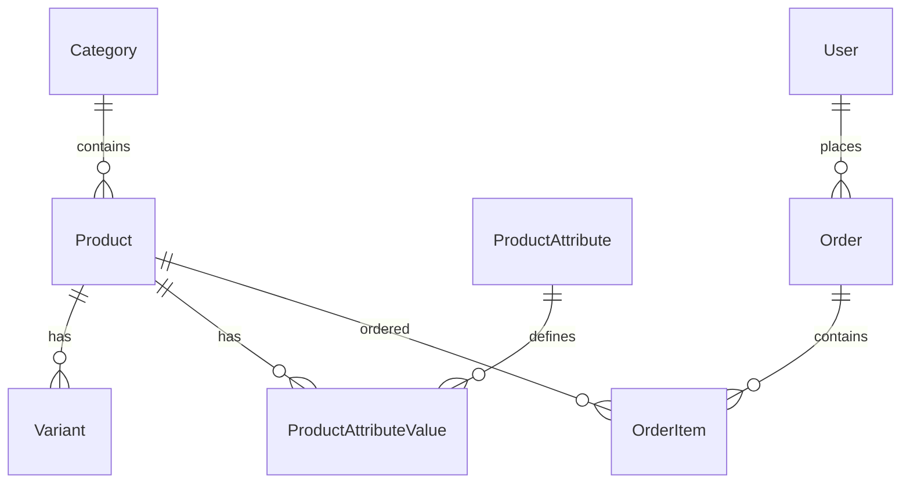

<h1 align="center">
  <a href="https://expressjs.com/" target="blank"></a>
  <a href="https://www.typescriptlang.org/" target="blank"></a>
  <a href="https://typeorm.io/" target="blank"></a>
  <a href="https://www.postgresql.org/" target="blank"></a>
  <a href="https://redis.io/" target="blank"></a>
  <a href="https://www.rabbitmq.com/" target="blank"></a>
</h1>

<p align="center">A powerful <a href="http://nodejs.org" target="_blank">Express.js</a> with <a href="https://www.typescriptlang.org/" target="_blank">TypeScript</a> boilerplate for building scalable e-commerce applications.</p>

<p align="center">
  
  
  
</p>

## Description

A comprehensive e-commerce backend API built with Express.js and TypeScript, featuring modular architecture inspired by NestJS, advanced caching strategies, queue-based processing, and Entity-Attribute-Value (EAV) pattern for flexible product management.

**Demo API**: [http://localhost:8000/api-docs](http://localhost:8000/api-docs) (when running locally)

## Table of Contents

- [Features](#features)
- [Tech Stack](#tech-stack)
- [Getting Started](#getting-started)
- [Project Structure](#project-structure)
- [Database Schema](#database-schema)
- [API Documentation](#api-documentation)
- [Queue Processing](#queue-processing)
- [Caching Strategy](#caching-strategy)
- [Docker Setup](#docker-setup)
- [Testing](#testing)
- [Contributing](#contributing)
- [License](#license)

## Features

- [x] **Modular Architecture** - Clean separation of concerns with modules
- [x] **TypeScript** - Full TypeScript support with strict typing
- [x] **Database** - PostgreSQL with TypeORM for data persistence
- [x] **Authentication & Authorization** - JWT-based auth with role-based access
- [x] **Caching** - Redis-based multi-layer caching (metadata, price, list)
- [x] **Queue Processing** - RabbitMQ for background tasks (image upload, email)
- [x] **EAV Pattern** - Flexible product attributes without schema changes
- [x] **File Upload** - Cloudinary integration with async processing
- [x] **Rate Limiting** - API protection with express-rate-limit
- [x] **Validation** - Request validation with class-validator
- [x] **Swagger Documentation** - Auto-generated API docs
- [x] **Database Seeding** - Automated data seeding for development
- [x] **Error Handling** - Centralized error handling with custom exceptions
- [x] **Logging** - Structured logging with rotation
- [x] **Docker Support** - Containerized deployment
- [x] **Testing** - Unit and integration tests with Jest
- [x] **CI/CD Ready** - GitHub Actions workflow

## Tech Stack

### Core Technologies
- **Runtime**: Node.js (>=14.0.0)
- **Framework**: Express.js 4.21.0
- **Language**: TypeScript 5.6.2
- **Database**: PostgreSQL
- **ORM**: TypeORM 0.3.25

### Infrastructure & Tools
- **Cache**: Redis 4.7.1
- **Queue**: RabbitMQ (amqplib 0.10.8)
- **File Storage**: Cloudinary
- **Image Processing**: Sharp 0.34.3
- **Validation**: class-validator, class-transformer
- **Documentation**: Swagger (swagger-jsdoc, swagger-ui-express)
- **Security**: Helmet, CORS, Rate Limiting
- **Testing**: Jest 30.0.5
- **Containerization**: Docker & Docker Compose

### Development Tools
- **Code Quality**: ESLint, Prettier
- **Process Manager**: Nodemon
- **Type Checking**: TypeScript strict mode
- **Path Mapping**: Module path aliases

## Getting Started

### Prerequisites
- Node.js (v14 or higher)
- PostgreSQL (v12 or higher)
- Redis (v6 or higher)
- RabbitMQ (v3.8 or higher)
- npm or yarn

### Installation

1. **Clone the repository**
   ```bash
   git clone https://github.com/your-username/ecommerce-app.git
   cd ecommerce-app/backend
   ```

2. **Install dependencies**
   ```bash
   npm install
   ```

3. **Environment Configuration**
   ```bash
   cp .env.sample .env
   ```
   
   Configure your environment variables in `.env`:
   ```env
   PORT=8000
   DB_HOST=localhost
   DB_NAME=ecommerce_db
   DB_USER=postgres
   DB_PASSWORD=your_password
   DB_PORT=5432
   
   REDIS_HOST=localhost
   REDIS_PORT=6379
   
   RABBITMQ_URL=amqp://localhost:5672
   DEBUG_CONSOLE=true
   
   JWT_ACCESS_SECRET=your_jwt_secret
   JWT_REFRESH_SECRET=your_refresh_secret
   
   FRONTEND_URLS=http://localhost:3000,http://127.0.0.1:3000,http://localhost:8000
   RABBITMQ_URL=amqp://localhost:5672
   
   CLOUDINARY_CLOUD_NAME=your_cloud_name
   CLOUDINARY_API_KEY=your_api_key
   CLOUDINARY_API_SECRET=your_api_secret
   ```

4. **Database Setup**
   ```bash
   # Run migrations
   npm run migration:run
   
   # Seed database
   npm run seed:roles
   npm run seed:users
   npm run seed:categories
   npm run seed:products
   npm run seed:variants
   npm run seed:product-attributes
   npm run seed:product-attribute-values
   ```

5. **Start the application**
   ```bash
   # Development mode
   npm run dev
   
   # Production mode
   npm run build
   npm start
   
   # Start queue worker (in separate terminal)
   npm run worker:dev
   ```

6. **Access the application**
   - API: http://localhost:8000
   - Swagger Docs: http://localhost:8000/api-docs
   - Default admin: admin@example.com / admin123

## Project Structure

```
src/
├── module/                  # Feature modules
│   ├── authentication/     # Auth module (login, register, tokens)
│   ├── user/               # User management
│   ├── product/            # Product management with EAV
│   ├── category/           # Product categories
│   ├── variant/            # Product variants
│   ├── order/              # Order processing
│   └── role/               # Role-based access control
├── config/                 # Configuration files
│   ├── typeorm.config.ts   # Database configuration
│   ├── redis.config.ts     # Redis configuration
│   └── cors.config.ts      # CORS settings
├── database/               # Database related files
│   ├── migrations/         # TypeORM migrations
│   └── seeds/              # Database seeders
├── queue/                  # Queue processing
│   ├── jobs/               # Job definitions
│   ├── processors/         # Job processors
│   └── config/             # Queue configuration
├── cache/                  # Caching strategies
│   ├── strategies/         # Cache implementations
│   └── managers/           # Cache managers
├── middleware/             # Custom middleware
├── utils/                  # Utility functions
├── errors/                 # Custom error classes
├── logger/                 # Logging configuration
└── constants/              # Application constants
```

## Database Schema

### Core Entities
- **Users** - User accounts with role-based access
- **Products** - Main product catalog
- **Categories** - Product categorization
- **Variants** - Product variations (size, color, etc.)
- **Orders** - Customer orders and order items

### EAV Pattern
- **ProductAttribute** - Dynamic attribute definitions
- **ProductAttributeValue** - Attribute values for products

### Relationships


## API Documentation

The API documentation is automatically generated using Swagger and available at `/api-docs` when the server is running.

### Key Endpoints

#### Authentication
- `POST /api/v1/auth/login` - User login
- `POST /api/v1/auth/register` - User registration
- `POST /api/v1/auth/refresh` - Token refresh

#### Products
- `GET /api/v1/product` - List products with pagination
- `GET /api/v1/product/:id` - Get product details
- `POST /api/v1/product` - Create product (Admin)
- `PUT /api/v1/product/:id` - Update product (Admin)
- `POST /api/v1/product/:id/image` - Upload product image

#### Orders
- `POST /api/v1/order` - Create order
- `GET /api/v1/order` - List user orders
- `PUT /api/v1/order/:id/status` - Update order status

### Postman Collection
Import the [postman.collection.json](./postman.collection.json) file for complete API testing.

## Queue Processing

### Background Jobs
- **Image Upload** - Resize and upload images to Cloudinary
- **Order Processing** - Handle order notifications and inventory updates
- **Email Notifications** - Send transactional emails

### Queue Architecture
```typescript
// Job Definition
interface UploadImageJobPayload {
  productId: number;
  imageBuffer: string;
  originalName: string;
}

// Usage
const job = UploadImageJob.createJob(payload);
await queueService.addJob('image-upload', job);
```

### Worker Management
```bash
# Start worker processes
npm run worker        # Production
npm run worker:dev    # Development with hot reload
```

## Caching Strategy

### Multi-Layer Caching
1. **Metadata Cache** - Product basic info (5 min TTL)
2. **Price Cache** - Product pricing (2 min TTL)
3. **List Cache** - Product listings (3 min TTL)
4. **Variants Cache** - Product variants (5 min TTL)

### Cache Implementation
```typescript
// Smart caching with automatic invalidation
@CacheInvalidate((args) => ['product:list:*'])
async updateProduct(id: number, data: UpdateProductDto) {
  // Update logic
  await this.productCache.smartUpdate(id, data, updatedProduct);
}
```

### Cache Keys Structure
```
product:{id}:meta       # Product metadata
product:{id}:price      # Product pricing
product:{id}:variants   # Product variants
product:list:{hash}     # Product list cache
```

## Docker Setup

### Development with Docker Compose
```bash
# Start all services
docker-compose up -d

# View logs
docker-compose logs -f app

# Stop services
docker-compose down
```

### Production Deployment
```bash
# Build production image
docker build -t ecommerce-api .

# Run with environment variables
docker run -d -p 8000:8000 --env-file .env ecommerce-api
```

### Services in Docker Compose
- **app** - Express.js application
- **db** - PostgreSQL database
- **redis** - Redis cache
- **rabbitmq** - Message queue

## Testing

### Running Tests
```bash
# Unit tests
npm test

# Integration tests
npm run test:e2e

# Test coverage
npm run test:coverage

# Watch mode
npm run test:watch
```

### Test Structure
```
src/
├── module/
│   └── product/
│       ├── __tests__/
│       │   ├── product.service.spec.ts
│       │   └── product.controller.spec.ts
│       └── ...
└── ...
```

### Test Configuration
- **Framework**: Jest with TypeScript support
- **Mocking**: Database and external services mocked
- **Coverage**: Minimum 80% coverage requirement

## Scripts Reference

```json
{
  "dev": "Development server with hot reload",
  "build": "Build production bundle",
  "start": "Start production server",
  "test": "Run tests",
  "worker": "Start queue worker",
  "migration:generate": "Generate database migration",
  "migration:run": "Run database migrations",
  "seed:*": "Run database seeders"
}
```

## Contributing

We welcome contributions! Please follow these steps:

1. **Fork the repository**
2. **Create feature branch**
   ```bash
   git checkout -b feature/amazing-feature
   ```
3. **Commit your changes**
   ```bash
   git commit -m 'Add some amazing feature'
   ```
4. **Push to the branch**
   ```bash
   git push origin feature/amazing-feature
   ```
5. **Open a Pull Request**

### Development Guidelines
- Follow TypeScript strict mode
- Write tests for new features
- Update documentation as needed
- Follow existing code patterns
- Use conventional commit messages

### Code Quality
- **Linting**: ESLint with TypeScript rules
- **Formatting**: Prettier configuration
- **Pre-commit**: Husky hooks for quality checks

## Checklist for New Deployments

When deploying this template:

- [ ] Update `.env` with your configuration
- [ ] Change database credentials
- [ ] Update Cloudinary settings
- [ ] Configure Redis connection
- [ ] Set up RabbitMQ
- [ ] Update JWT secrets
- [ ] Configure CORS origins
- [ ] Set up monitoring and logging
- [ ] Update README with your project details

## Performance & Monitoring

### Key Metrics
- **Response Time**: API endpoints < 200ms average
- **Cache Hit Rate**: > 80% for frequently accessed data
- **Queue Processing**: < 5 second average job processing
- **Database**: Optimized queries with proper indexing

### Monitoring Tools
- Application logs with structured logging
- Redis monitoring for cache performance
- Database query performance tracking
- Queue job success/failure rates

## Security Features

- **JWT Authentication** with refresh tokens
- **Rate Limiting** - API endpoints protection
- **Input Validation** - Request payload validation
- **SQL Injection Protection** - TypeORM parameterized queries
- **XSS Protection** - Helmet security headers
- **CORS Configuration** - Controlled origin access

## License

This project is licensed under the MIT License - see the [LICENSE](LICENSE) file for details.

## Support

- **Documentation**: Check the inline code documentation
- **Issues**: [GitHub Issues](https://github.com/your-username/ecommerce-app/issues)
- **Discussions**: [GitHub Discussions](https://github.com/your-username/ecommerce-app/discussions)

---

<p align="center">Made with ❤️ by Kayen</p>
